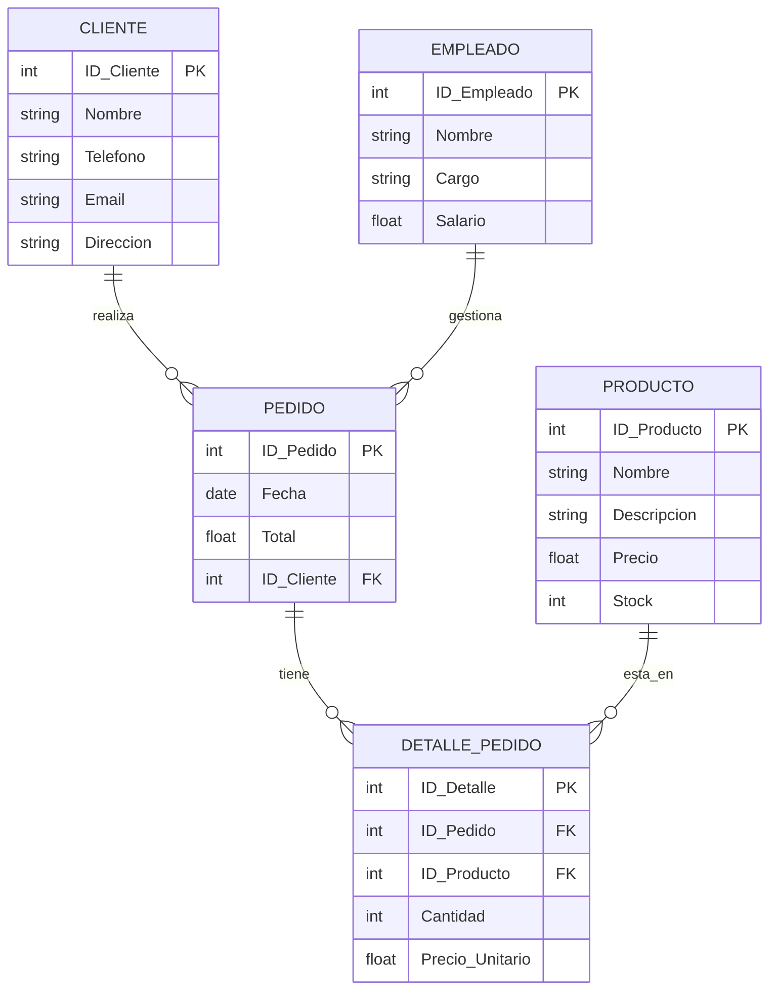

# xxxxx

```mermaid
erDiagram
    CLIENTE {
        int ID_Cliente PK
        string Nombre
        string Telefono
        string Email
        string Direccion
    }
    
    PRODUCTO {
        int ID_Producto PK
        string Nombre
        string Descripcion
        float Precio
        int Stock
    }
    
    PEDIDO {
        int ID_Pedido PK
        date Fecha
        float Total
        int ID_Cliente FK
    }
    
    DETALLE_PEDIDO {
        int ID_Detalle PK
        int ID_Pedido FK
        int ID_Producto FK
        int Cantidad
        float Precio_Unitario
    }
    
    EMPLEADO {
        int ID_Empleado PK
        string Nombre
        string Cargo
        float Salario
    }
    
    CLIENTE ||--o{ PEDIDO : realiza
    PEDIDO ||--o{ DETALLE_PEDIDO : tiene
    PRODUCTO ||--o{ DETALLE_PEDIDO : esta_en
    EMPLEADO ||--o{ PEDIDO : gestiona

```
